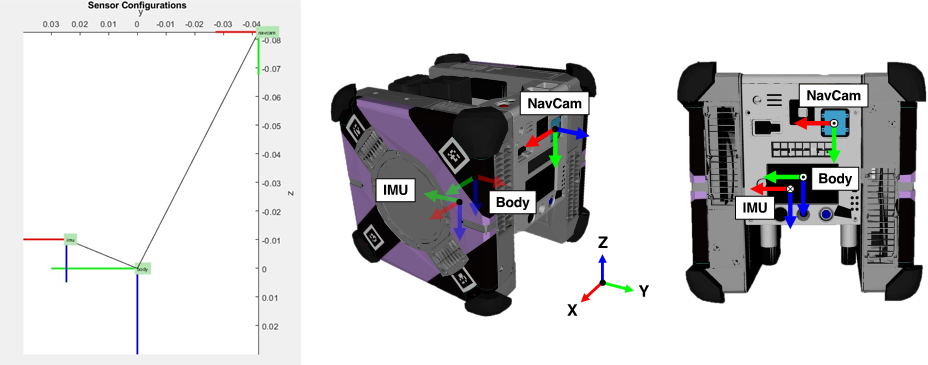
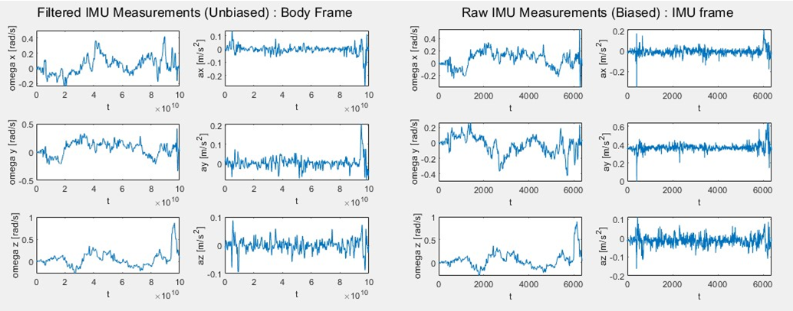
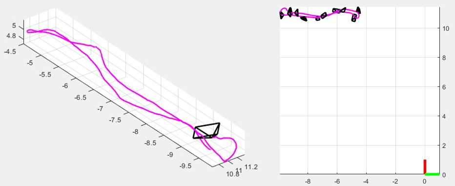

# Astrobee-Dataset-Tool
This repository provides a loader for the ZIP dataset format associated with the Astrobee datasets. 

## Dataset Availability
The datasets can be found at the following URL:
[Astrobee ISS Dataset](https://astrobee-iss-dataset.github.io/)

## Offline Matlab Visualization
### Running the Script
You can run the script by typing the following in your terminal:
```bash
run main_script.m
```
### Output Figures
The script generates several figures that help in the analysis of the sensor configurations and measurements:

- **Sensor Configuration**: Displays the positions of the sensors and the rigid body transformations that link them.
  


- **IMU Measurements**: Shows both filtered and raw IMU acceleration and angular velocity measurements. These measurements are taken in the zero-g environment of the ISS, where gravitational acceleration is not present.



- **Trajectories**: Visualizes the pseudo groundtruth trajectory.




## Code Reference
https://github.com/ethz-asl/dataset_tools.git

https://github.com/PyojinKim/ARKit-Data-Logger.git
